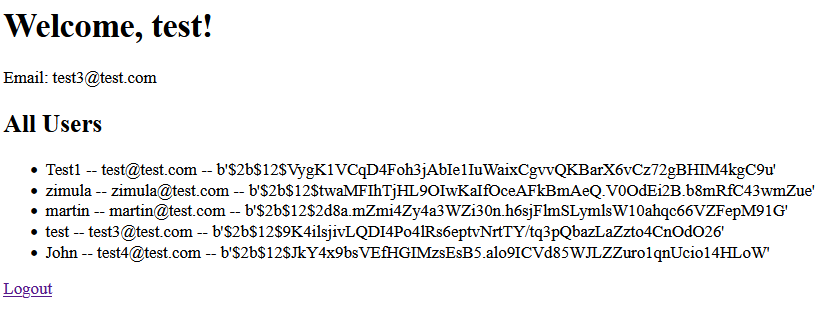
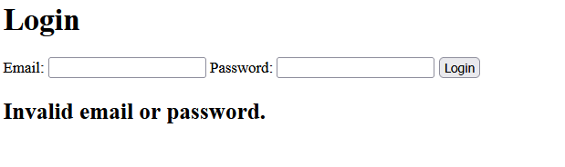
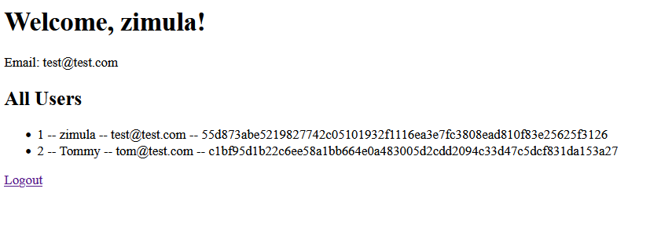
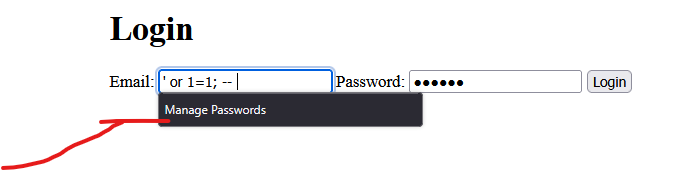
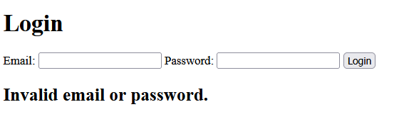

# The entry point to the application is hash.py. 

# 4.0. Adding a login mechanism
The login mechanism below follows the following steps
- gets email and password from form. 
- confirms that they are not null. 
- gets all the members from database. 
- the funct next extracts the first match form the iterator. 
- if the hash returns a string similar to the typed in password, the user template in rendered. Where all the users and their information are displayed. 
- Else the invalid login message is displayed. And the user is asked to enter their information again.

## 4.0.1. Result of successful login
Below you can see what the user is met with when they login successfully.

## 4.0.2. Result of Failure
If the wrong information is typed in. The app will simply show you the message below. 

# 4.1. Replacing bcrypt with Sha256
- Replacing bcrypt with Sha256 from hashlib. 
- Update db.py to make sure it saves in the right table (users256)
- Left comment column as optional because I havent updated the template. 
- On a successful login, the user sees the following

## 4.1.1. Attempt with SQL injection
It seems impossible to get using sql injection. The application doesn't do anything.   

## 4.1.2. Attempt with invalid information

