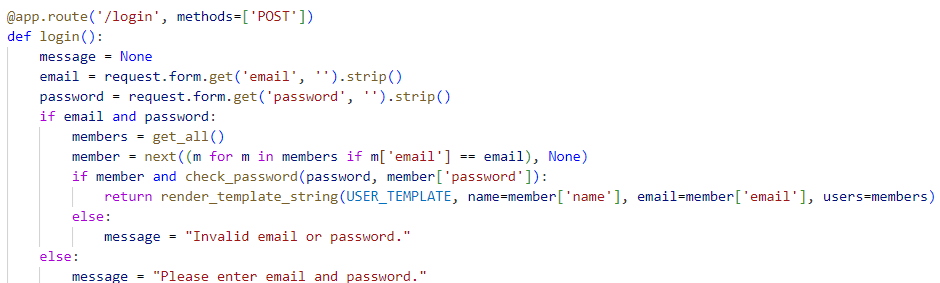

# Adding a login mechanism
The login mechanism below follows the following steps
- gets email and password from form. 
- confirms that they are not null. 
- gets all the members from database. 
- the funct next extracts the first match form the iterator. 
- if the hash returns a string similar to the typed in password, the user template in rendered. Where all the users and their information are displayed. 
- Else the invalid login message is displayed. And the user is asked to enter their information again.

## Result of successful login
## Result of Failure

# Replacing bcrypt with Sha256

