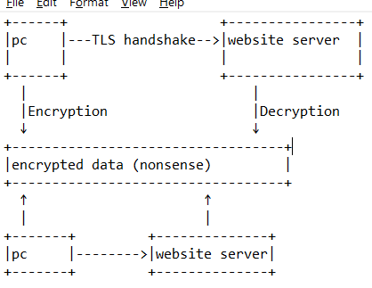

# INTRO TO ENCRYPTION

## Day 1: Classical ciphers/ basic encryption. 
1. Caesar cipher: Works by substituting letters using integers. The integer represents the position in the alphabet.
    1.1. Can be solved using simple math like so:

        i. Encryption:
        En(x) = (x + n) mod 26
        - mod: to ensure that if the result is greater than 25, it starts from the beginning.
        - Divides by 26 and returns the remainder (new position)

        ii. Decryption:
        Dn(x) = (x - n + 26) mod 26
        - Adding 26 ensures the result is non-negative

        ***Requires knowing the cipher number/shift.

2. Vigenère Cipher: Takes Caesar a step further by using a different number value for each letter based on a keyword.
    2.1. Can be solve using the following formula: 

        i. Encryption:
        C_i = (P_i + K_i) % 26
        - P_i: Position of the plaintext letter in the alphabet (A=0, B=1, ..., Z=25)
        - K_i: Position of the key letter in the alphabet (A=0, B=1, ..., Z=25)
        - C_i: Position of the ciphertext letter in the alphabet (A=0, B=1, ..., Z=25)

        ii. Decryption:
        P_i = (C_i - K_i + 26) % 26
        - Adding 26 ensures the result is non-negative

        iii. Each letter of the plaintext is encrypted using a different Caesar cipher based on the corresponding letter of the key.

        iv. Example:
       - Plaintext: TOOL (positions: 19, 14, 14, 11)
       - Key: DEAD (repeated to match plaintext length: DEAD, positions: 3, 4, 0, 3)
       - Encryption:
            T (19) + D (3) = W (22)
            O (14) + E (4) = S (18)
            O (14) + A (0) = O (14)
            - L (11) + D (3) = O (14)
            Ciphertext: WSOO

## Day 2: Encryption TLS.
3. Cornerstones og Encryption

        i. Confidenciality: Ability to restrict data/ parts of it to some users.  
        ii. Authenticity: Ability to confirm the the identity of both recipient and data source. 
        iii. Integrity: Confirm that data has not been interfered with during transfer.
        v. Non Repudiation:Data source must not be able to deny that it's the souce. 

3.1. Illustration via GnuPG/ GPG4WWin

3.1.1. GnuPG (GNU privacy guard):

A free open source software for encrypting and signing data. 
    
    The tool does the following
        i. Encryption: both files and messages. 
        ii. Digital signatures: add digital signatures to data for authentication and guarantee safety in transit.
        iii. Key management: generating, storing & managing cryptographic keys (public and private keys). 
        iv. Email security: encrypt and sign emails. 
        v. File encryption: Used to encrypt individual files.  
        vi. Secure communication: chat and file transfer encryption. 
3.2. How it works

    i. Symmetric-key cryptography:for fast encryption of large amounts of data. 
    ii. Assymmetric/ Public-key cryptography: for secure key exchange. 
    iii. Steps: 
        - generating key pairs: each user creates a pair of keys (public and private).  
        - encrypting data: encrypt message using public key (requires matching private key to decrypt). 
        - signing data: uses private and is verified using matching public key.

3.3. How to use GnuPG
        
        i. On windows: install gpg4win. 
        ii. open cmd: 
            - type gpg --list-key (finds the directory automatically)
            - type gpg --gen-key (prompts for a secret phrase) and generates private and public key. 
            - Private key is not include in the output. 
            - gpg --edit-key: lets you edit key attributes. 
            - gpg --delete-key <id>: lets you delete key. 
            - gpg --export -a "user_id" > "path\outputfile.asc": exports file to another folder. 
            - gpg --import "path\file": imports key
            - gpg --edit-key id from import: 
            - fpr: confirms key. 
        iii. Making public-key available
            - use export method like above: make downloadable from site. 
            - display on websit: fpr and paste it on site.
            - key servers (keyp.opengpg.org will be used): gpg --send-keys --keyserver keys.opengpg.org "name" 
            - failde when I used name but the id (3E65401BA3FAF2A1) worked fine. 
        iv. Encrypting a file (either by username or key id)
            - gpg -r "username" -e file
            - output: file.extension.gpg
            - opening before decryption: „^’<î¾c@ýoxé!Í€d}2J³|?)ÄìöN~_5‘ñ׿Zþ0ÕŒã0ìŠ)Ÿ“XzâNm~‹í9¬CCßÚ¯¼$=Ü÷1Ù -„!{d…ÔÀo	Ð#"£PÍÓM,m¸’Ñÿ²rÕ-¼Á¥9Þ*üy~‚Aƒ_(Š|Ë’SØý®ÉïüvJÑŠ ôÑËp97àÂÄVµ¦YûTõ¨QQ}™=Uý•í9Ñ «¢ÅF_iEO0®ÖPóÚ…è<w“±^MDJŸdæߥY ‡jåÆ¡Ô}Í¥Xa6·;›U¯átHr¥0弌çüºdp[L!;¼Ø¿dN§zrËÉ[WX8ÿ¾$Œ.€4c¶\ÖìK>“ÎþuV7éށg硲™ýZ ð%UÝéÛ½ù,áñnL:„‚"ÂØ£#’cŽ2DšßKIÿ|óF#/1v¯Ô|':d)Qg;eæúx2Éøé'Á8ˆŒP#p¤ÒÖlQÀÕŒ…ã¡E1Ù“k‚K
        v. Decryption: 
            -gpg -d Encryption_test.txt.gpg
            - output: gpg: encrypted with cv25519 key, ID
            921D163CEEBE1063, created 2025-02-03
            "Martin Zimula <zimula@live.dk>"
            name: Martin Zimula
            email: zimula@live.dk
            phrase: Testing123

            output from cmd:
            pub   ed25519 2025-02-03 [SC] [expires: 2028-02-03]
            64246580A3AD4578FE1ED2693E65401BA3FAF2A1
            uid           [ultimate] Martin Zimula <zimula@live.dk>
            sub   cv25519 2025-02-03 [E] [expires: 2028-02-03]
            message: Hello!.
3.4. TLS 
Simple diagram and explanation.

    Basically, the client shares a key with the server 
    before sending encrypted data. 
    The server uses the key to decrypt the data (revise osi). 

## Day 3: Hashing
4. Hashing algorithms: they differ in the complexity of hashes they produce.  
    i. md5
    ...
    viii. bcrypt 

4.1. Collision: String resulting in similar hashes. Probability is low with existing algorithms. 
4.2. Assignment to check if a password is on the rokyu.text. 

### Steps in solving the exercises. 
    - get rockyou.txt
    - create an app
    - add a database
    - create a user table (user_id, user_name_, user_password as blob (bcrypt hash), )
    - on passwrord creation compare with rockyou.txt. 
    - use singleton pattern to deal with the text file. 
    - add modules to gitignore
#### singleton pattern and relevance to the assignment
    i. Allows to create just one instanc of a class. 
    ii. 

